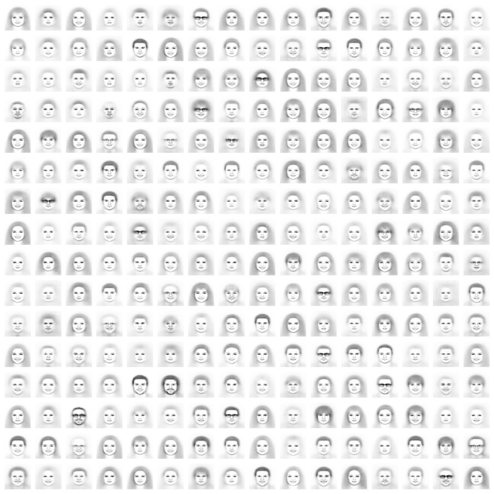
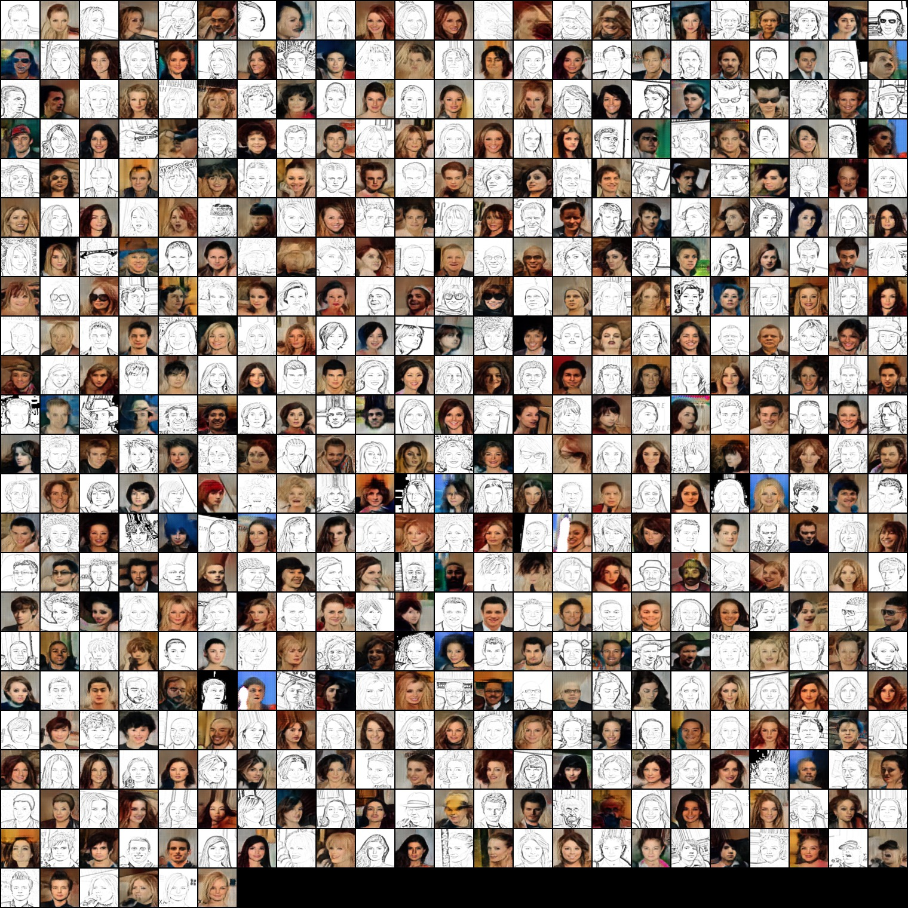

Text2Sketch2Face
==============================

This Flask-based application generates sketches from textual descriptions using deep learning and generative models. It also transforms sketches into realistic facial images using advanced image translation techniques.

## Features

### 🎨 Text-to-Sketch Generation
- Utilizes **Multi-Head Self-Attention** for text encoding.
- Employs a **Conditional Variational Autoencoder (CVAE)** conditioned on extracted attributes for generating sketches.
- Enhances sketches using a **Conditional Generative Adversarial Network (CGAN)** to produce high-fidelity facial details.

### 🖼️ Sketch-to-Face Translation
- Explores **CycleGAN, Pix2Pix, and supervised models** for sketch-to-face transformation.
- Achieves the best results with **CycleGAN**, generating highly realistic facial images from sketches.

## 🖼️ Sample Outputs

### 🔹 Text-to-Sketch Generation  
 

### 🔹 Sketch-to-Face Translation  

